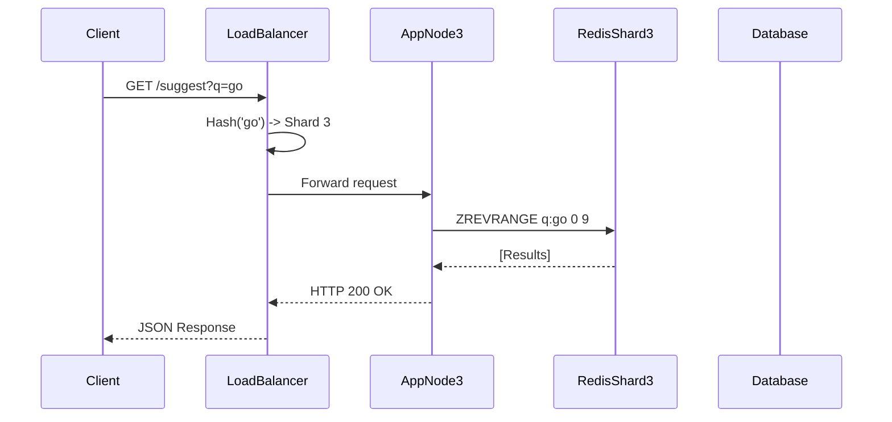

# Typeahead Autocomplete Engine: System Architecture and Performance Report

## 1. System Architecture

The Typeahead Autocomplete Engine employs a sharded, distributed architecture designed to minimize read latency for autocomplete suggestions while mitigating database load during high-volume write operations (search events).

### 1.1 Architecture Diagram


*(Note: If viewing this markdown file in an environment without access to the local filesystem, the image above will not render. See the instructions at the end of this document or use a PDF export to ensure the image is embedded permanently.)*

### 1.2 Component Overview and Request Lifecycle

The system comprises the following core components:

1. **Load Balancer (Gateway Proxy):** Acts as the singular entry point for all client requests. It implements a consistent hashing algorithm against the search query prefix to route requests deterministically to specific application nodes.
2. **Application Nodes:** Stateless services implemented in Bun. These nodes handle read requests (`/suggest`) by querying a dedicated local Redis shard. Write requests (`/search`) are buffered in an in-memory queue.
3. **Redis Partitioning:** The caching layer is sharded across multiple Redis instances. Each instance is paired with a specific Application Node to enforce cache locality.
4. **PostgreSQL Database:** Serves as the persistent system of record. It maintains the absolute `query_counts` and a `dirty_prefixes` ledger to track data requiring cache invalidation.
5. **Synchronization Daemon:** A background service that polls the `dirty_prefixes` ledger in PostgreSQL. It computes the updated Top-K results and pushes them to the respective Redis shards.

### 1.3 Sequence Flow



## 2. Dataset and Initialization

The system requires an initial dataset to pre-warm the caching layer and populate the database.

### 2.1 Source Data
The primary corpus is located at `data/search_frequencies.json`, containing distinct search queries and historical usage frequencies.

### 2.2 Bootstrapping Process
The `scripts/init.ts` utility handles data ingestion. The script performs the following operations:
- Iterates through the corpus to compute all valid prefixes for each query.
- Applies the hashing function to determine the target Redis partition for each prefix.
- Executes batched Redis Pipelines to load the initial Top-K sets into memory.

**Docker Orchestration:**
```bash
docker compose up --build
```
This command initializes the PostgreSQL schema, starts the Redis shards, executes the seeding script, and boots the application mesh.

## 3. API Specification

All traffic is routed through the Load Balancer on port `8080`.

### 3.1 GET `/suggest`
Retrieves autocomplete suggestions for a given prefix.

**Parameters:**
- `q` (string): The search prefix.
- `rank` (string): Ranking algorithm. Accepts `basic` (historical volume) or `recency` (time-decayed volume). Default: `basic`.
- `limit` (integer): Maximum suggestions to return. Default: `10`.

**Response Behavior:**
Cache misses trigger a synchronous fallback read to PostgreSQL and enqueue an asynchronous cache rebuild.

### 3.2 POST `/search`
Records a completed search event.

**Payload:** `{"query": "string"}`

**Response Behavior:**
Returns `HTTP 202 Accepted` immediately. The event is buffered in memory to avoid synchronous database locks.

### 3.3 GET `/trending`
Retrieves globally popular queries by federating a request across all internal Redis partitions and aggregating the highest-scoring entities.

### 3.4 GET `/metrics`
Exposes cluster telemetry, including cache hit rates, batch flush counts, and total system throughput.

## 4. Design Decisions and Trade-offs

### 4.1 Consistent Hashing
- **Implementation:** Requests are routed based on a hash of the query prefix rather than round-robin load balancing.
- **Trade-off:** This enforces strict cache locality, meaning a specific prefix exists only in one Redis shard, significantly reducing overall memory footprint. The drawback is potential uneven load distribution if the underlying vocabulary clusters heavily around specific prefix hashes.

### 4.2 Write Buffering
- **Implementation:** The `/search` endpoint buffers requests in an in-memory array. The buffer is flushed to PostgreSQL in batches (e.g., chunks of 100).
- **Trade-off:** This provides a substantial reduction in database transaction overhead and disk I/O. However, it introduces a durability risk: in the event of an unexpected node failure, searches held in the volatile buffer are permanently lost.

### 4.3 Asynchronous Cache Synchronization
- **Implementation:** Redis is not updated synchronously during a `/search` request. Instead, the `dirty_prefixes` ledger is updated, and the Synchronization Daemon independently rebuilds the cache.
- **Trade-off:** This implements eventual consistency. The critical read-path (`/suggest`) remains highly performant as it never waits for write operations. The cost is a brief window where recent searches are not reflected in autocomplete results.

## 5. Performance Evaluation

Benchmarks were executed locally using a dataset of 93,387 queries, driving 1.72 million search permutations. The test suite (`bun run benchmark`) simulated 4,000 HTTP requests with a concurrency limit of 32.

### 5.1 Latency Metrics (Read Path)
| Configuration | Mean Latency | P50 | P95 | P99 | Throughput |
| :--- | :--- | :--- | :--- | :--- | :--- |
| `rank=basic` | 0.63ms | 0.52ms | 1.21ms | 2.26ms | ~50,400 RPS |
| `rank=recency` | 0.63ms | 0.52ms | 1.35ms | 2.49ms | ~50,800 RPS |

The metrics demonstrate that recency-based ranking incurs negligible latency overhead during reads, as score decay computations are delegated to the background daemon.

### 5.2 Write Optimization
- **Search Events Processed:** 2,000
- **Database Transactions Executed:** 22
- **Write Optimization Factor:** 90.9x reduction in database commits.

The in-memory buffering strategy effectively eliminates database locking constraints under sustained load.

### 5.3 Cache Resilience
The system achieved a **100% cache hit rate** during benchmark testing due to the pre-warming ingestion phase. In the event of an eviction, the fallback-and-rebuild mechanism ensures the system remains highly available, albeit with a temporary latency penalty on the initial missed read.

## 6. Application Interface (Screenshots)

The following screenshots demonstrate the autocomplete functionality and the trending search interfaces.


